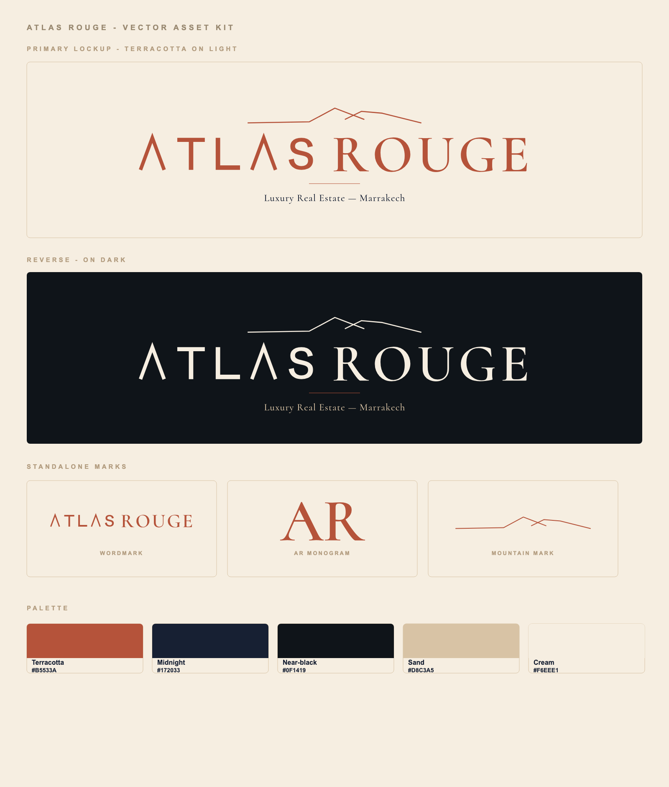

# Atlas Rouge — Vector Asset Kit

Vectorized logo assets rebuilt from the brand book. Every deliverable SVG is
**pure vector**: the final marks use paths/strokes, not live text, so they
render consistently, scale cleanly, and are print-ready.



## Typography

| Element | Font | Weight | Tracking |
|---------|------|--------|----------|
| `ATLAS` wordmark half | **Custom grotesk**, based on Schibsted Grotesk proportions | ~500/600 visual weight | wide manual spacing |
| `ROUGE` wordmark half | **Cormorant** | SemiBold (~600) | +0.075 em |
| Tagline `Luxury Real Estate — Marrakech` | **Cormorant** | Medium (~500) | +0.05 em |
| Monogram `AR` | **Cormorant** | SemiBold (~600) | — |

Important distinction: the brand-book typography system lists **Schibsted
Grotesk**, **Newsreader**, and **Inter** for the website/editorial system. The
raster logo artwork itself is more custom: `ATLAS` is a crossbarless geometric
grotesk treatment, while `ROUGE` and the title-case tagline match Cormorant's
curved `R`, high contrast, and editorial rhythm more closely than Newsreader.

### Eslogan / tagline details

Text: `Luxury Real Estate — Marrakech`

- Typeface: Cormorant
- Weight: Medium, approximately `500`
- Case: Title Case
- Tracking: `0.05em` (about `5%` of font size)
- Color on light backgrounds: Midnight `#172033`
- Color on dark backgrounds: Sand `#D8C3A5`
- Recommended CSS approximation if kept as live text:

```css
.atlas-tagline {
  font-family: "Cormorant", "Newsreader", Georgia, serif;
  font-weight: 500;
  letter-spacing: 0.05em;
  color: #172033;
}
```

For the alternate small uppercase lockup shown in the brand-book page, use
Inter or Schibsted Grotesk Medium with uppercase text and wider tracking
(`0.16em` to `0.22em`).

## Files (`out/`)

Each piece comes in three inks: `terracotta` (primary), `midnight` (one-color
dark), `cream` (reverse, for dark backgrounds). All have transparent
backgrounds except where noted.

| File | What |
|------|------|
| `logo-primary-terracotta.svg` | Full stacked lockup (mountains / wordmark / divider / tagline) — primary, on light |
| `logo-primary-reverse.svg` | Same lockup in cream + sand, for dark backgrounds |
| `logo-primary-on-cream.svg` | Same as primary but with a baked-in cream background (for quick previews/social) |
| `logo-16x9-on-cream.svg` / `.png` | Exact 1920×1080 presentation artboard, primary terracotta on warm cream |
| `logo-16x9-reverse.svg` / `.png` | Exact 1920×1080 presentation artboard, reverse cream/sand on near-black |
| `wordmark-{terracotta,midnight,cream}.svg` | `ATLAS ROUGE` only |
| `mark-mountains-{terracotta,midnight,cream}.svg` | Mountain mark only (favicon / app icon source) |
| `monogram-ar-{terracotta,midnight,cream}.svg` | `AR` monogram |
| `kit-preview.svg` | Self-contained preview sheet |
| `kit-preview.png` | The overview image above |

## Palette

`#B5533A` terracotta · `#172033` midnight · `#0F1419` near-black ·
`#D8C3A5` sand · `#F6EEE1` cream.

## Notes & honest caveats

- **Wordmark / tagline / mountains**: high-fidelity reconstructions. `ATLAS`
  is manually built to preserve the crossbarless A from the artwork; `ROUGE`
  and the tagline are flattened from Cormorant. The mountains are hand-built
  paths, visually matched to the artwork rather than traced pixel-for-pixel.
- **`AR` monogram**: this is `A`+`R` set tight in Cormorant. The brand-book
  monogram is custom lettering where the two letters interlock/share a stroke.
  Mine is a faithful *approximation*, not the exact custom glyph. If you want
  the exact interlock, it needs a few hand-edited passes (or the designer's
  original vector).
- These are **recreations** from the raster brand book, since no source vector
  existed in the repo. If the designer's original AI/SVG ever turns up, prefer
  it for the wordmark.

## Regenerate

```bash
python3 -m venv brand/.venv
brand/.venv/bin/pip install fonttools
# fonts (OFL) are in brand/fonts/ — re-download from github.com/google/fonts if missing
brand/.venv/bin/python brand/build_logo.py        # writes out/*.svg
bash brand/render.sh brand/out/<file>.svg out.png 2   # SVG -> PNG via headless Chrome
```

`build_logo.py` is the single source of truth for the geometry, colors, and
type parameters. `.venv/` is gitignored; `fonts/` holds the OFL font files used
to flatten the outlines.
